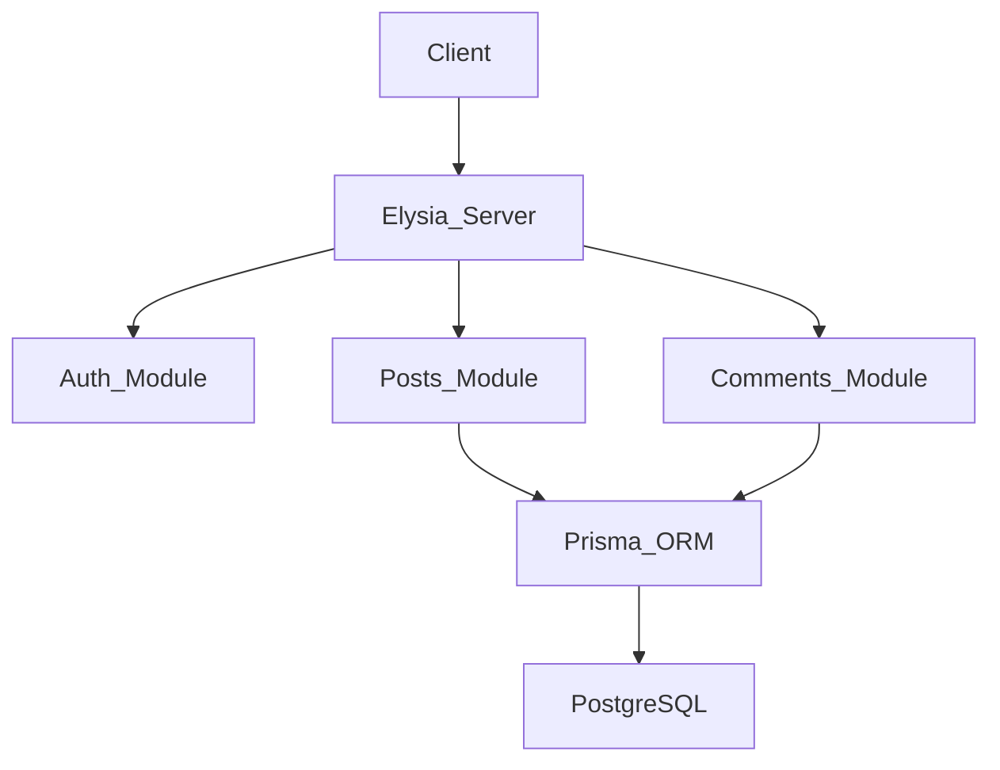

# Elysia Social Network Backend


A high-performance social network backend built with [ElysiaJS](https://elysiajs.com/), [Bun](https://bun.sh/), and [Prisma](https://www.prisma.io/).

## Features

-   **High Performance**: Powered by Bun runtime and ElysiaJS.
-   **Type Safety**: End-to-End type safety with TypeScript.
-   **Authentication**: JWT-based authentication with secure password hashing (Argon2 via Bun).
-   **Database**: PostgreSQL integration using Prisma ORM (v7).
-   **Comments**: Post comments system.
-   **Documentation**: Interactive Swagger API documentation.

## The Stack (And Why I Chose It)

### ⚡ Using Bun & ElysiaJS
While Node.js + Express is the industry standard, I chose **Bun + Elysia** for this project to demonstrate familiarity with next-generation tooling that prioritizes performance and developer experience.

-   **Performance**: Bun's runtime is significantly faster than Node.js, and Elysia exploits this to offer near-native speeds.
-   **Type Safety**: Elysia offers end-to-end type safety similar to tRPC but over standard REST pattern.
-   **Tooling Consolidation**: Bun acts as the runtime, package manager, test runner, and bundler, reducing dev-dependency bloat.

### 🐘 PostgreSQL & Prisma
-   **Data Integrity**: Relational data (Users <-> Posts) demands ACID compliance.
-   **Prisma ORM**: Chosen for its type-safe query builder which catches schema errors at compile time.
    -   *Note on N+1*: I explicitly use `include` (e.g., retrieving Author with Posts) to ensure efficient data fetching in a single query.

## Architecture

The project follows a **Feature-based Architecture**. This moves away from technical layers (controllers/services folders) to domain modules, improving scalability for growing teams.



## Getting Started

### Prerequisites
- [Bun](https://bun.sh/) (v1.0+)
- PostgreSQL (or Docker)

### Installation

1. Clone and install:
    ```bash
    bun install
    ```

2. Environment Setup:
    ```bash
    cp .env.example .env
    ```

    **Required Variables:**

    | Variable | Description |
    | :--- | :--- |
    | `DATABASE_URL` | PostgreSQL connection string |
    | `JWT_SECRET` | Secret key for signing tokens |

3. Database Migration:
    ```bash
    bun run prisma migrate dev --name init
    ```

## Development

Start the development server with hot-reloading:

```bash
bun run dev
```

The server will match at `http://localhost:3000`.

### API Documentation

Interactive Swagger documentation is available at:
`http://localhost:3000/swagger`

**Key Endpoints:**
- `POST /auth/signup`
- `POST /auth/signin`
- `GET /posts` (Cursor Pagination support)

## Testing & Quality

Run the test suite (Unit & Integration):

```bash
bun run test
```

| Command | Description |
| :--- | :--- |
| `bun run lint` | ESLint check |
| `bun run format` | Prettier fix |
| `bun run test:watch` | Run tests in watch mode |

## Docker Support

Run the full stack (App + DB) using Docker Compose:

```bash
docker-compose up --build
```

## Project Structure

```
src
├── auth/          # Feature: Authentication
├── posts/         # Feature: Posts (Controller, Service, Schema)
├── comments/      # Feature: Comments
├── lib/           # Shared: Prisma Client
├── utils/         # Shared: Hashing, JWT helpers
└── index.ts       # App Entry point
```

## Challenges & Trade-offs

### JWT vs Sessions
I utilized **JWT (Stateless)** for authentication.
-   *Pro*: Scales easily horizontally (no Redis session store needed).
-   *Con*: Revoking tokens is difficult.
-   *Mitigation*: I implemented short-lived access tokens.

### Pagination Strategy
Implemented **Cursor-based Pagination** for the feed.
-   *Why*: Offset pagination (`OFFSET 1000`) acts like a full table scan and kills performance on large datasets. Cursor search (`WHERE id < last_id`) is O(1).

## CI/CD Pipeline
- **GitHub Actions**: Workflow configured to run `bun test` and `bun run lint` on every push to `main`.